# JMOAB-ROS

This is a ros package for AT_JMOAB01 development shield on Jetson Nano/Xavier and Raspberry Pi for motor and I/O control.

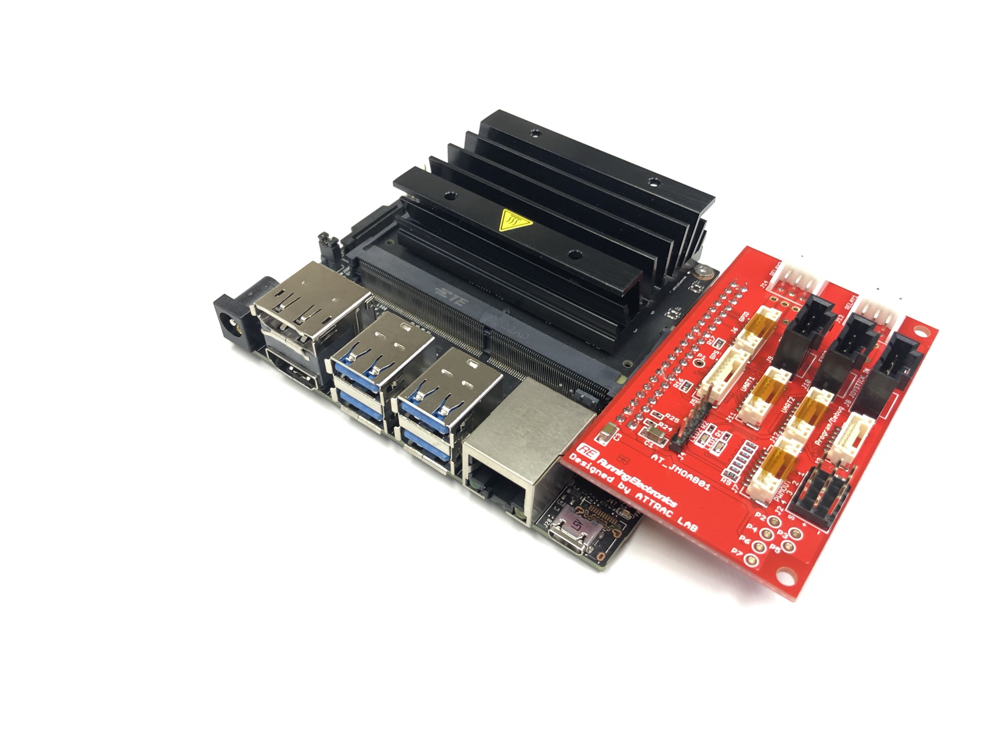

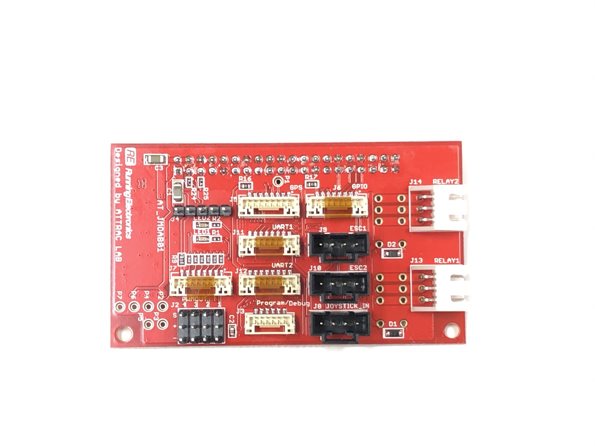

## Install

Install smbus2 python module for i2c communication 
- `pip install smbus2`

Clone this repo to src directory of catkin workspace
- `cd ~/catkin_ws/src`
- `git clone https://github.com/rasheeddo/jmoab-ros.git`

Checking that your computer (Jetson or Pi) could detect this device
- For Jetson Nano, it's using i2c bus 1, so you could use this `i2cdetect -y -r 1` then you should see a device address of 0x71
- For Jetson Xavier NX, it's using i2c bus 8, so you could use this `i2cdetect -y -r 8` then you should see a device address of 0x71

Build a package
- `cd ~/catkin_ws`
- `catkin_make`

Source environment
- `source ~/.bashrc` 
- `source ~/catkin/devel/setup.bash`

## Update JMOAB firmware

All of available firmware are in [firmwares](./firmwares/) directory.

To flash the firmware, please follow the step below, (must use Windows PC)

- first you will need to have Mini Prog3 [programmer](https://www.digikey.com/catalog/en/partgroup/psoc-miniprog3-programmer-debugger-cy8ckit-002/20080).

- Download PSocC Programmer [software](https://www.infineon.com/cms/en/design-support/tools/programming-testing/psoc-programming-solutions/?utm_source=cypress&utm_medium=referral&utm_campaign=202110_globe_en_all_integration-product_families#!downloads).

- Open the PSoC Programmer, it will shown as here

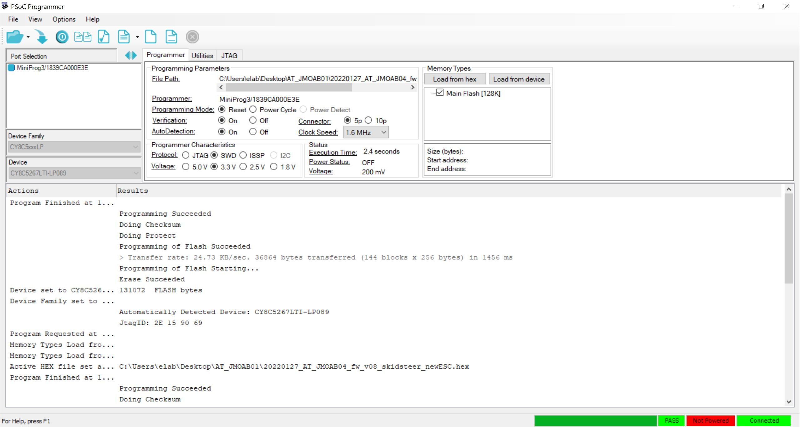

- Keep eyes on lower right corner, so it should show 3 green as PASS, POWERED, Connected. So you should plug the Mini Prog3 to the JMOAB J4 header for AT_JMOAB01 board or J2 header for other higher version. Make sure that the VTARG pin of the programmer is on the correct pin header on JMOAB. And also please power on the Jetson as well.

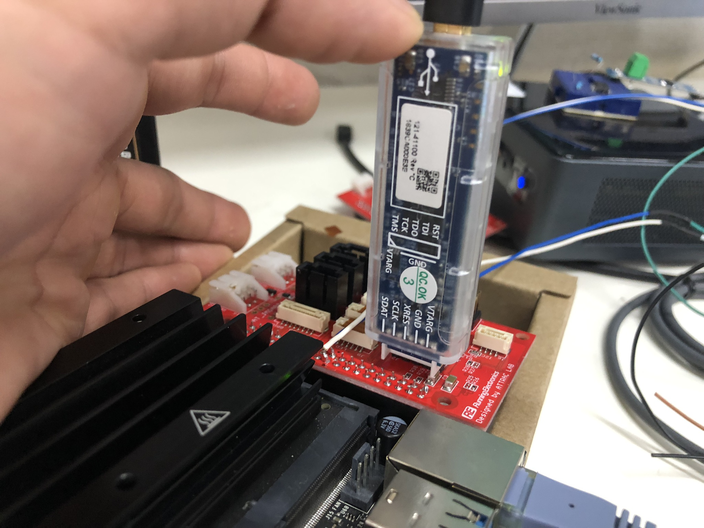

- Once you saw all three greens status, the select which firmware you would like to use, and click on Program button right next to Open button.

- If it's success, you will see the it's showing successful message.

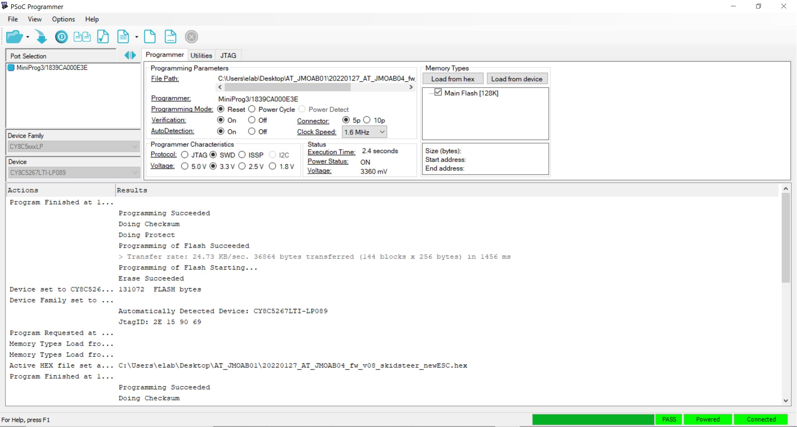

- You will need to power off and on the Jetson again to take affect of new firmware on JMOAB.

## JMOAB with all nodes

`roslaunch jmoab-ros jmoab-ros.alunch` will run all the nodes that have implemented.

Note that the default source code is for Jetson Nano for i2c bus 1, in case you want to use Jetson Xavier NX, you will need to change the i2c bus on [here](https://github.com/rasheeddo/jmoab-ros/blob/3333073baad1f318b0c07b3825c5ef1e6c7bb01a/src/jmoab-ros-atcart.py#L14) to 8. Similar with other jmoab nodes (e.g. IMU).

## JMOAB with ATCart Wheels

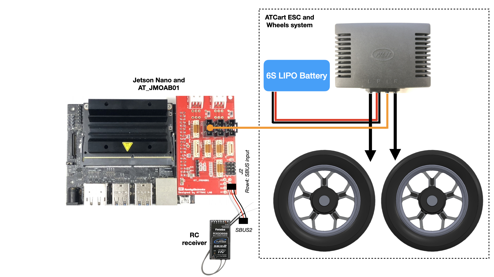

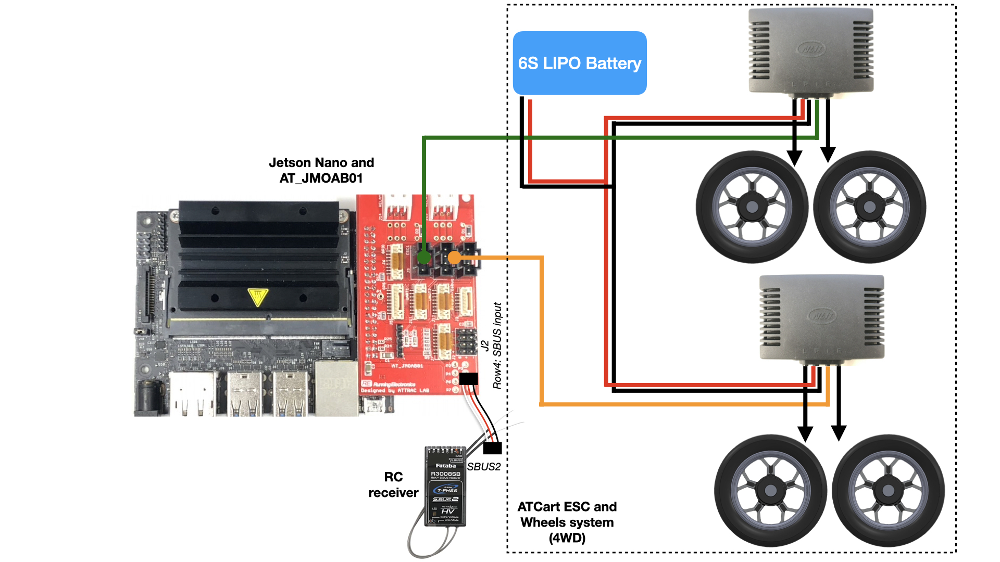

The board has an interface to send a command to control ATCart wheel system, it supports both regular 2-wheels or 4WD system. We need to have RC receiver which has SBUS functionality (Futaba as an example), and plug SBUS2 port from receiver to 4th row of J2 pin header. The board has failsafe function, if SBUS signal is lost, it will automatically switch itself to hold mode. We can change the mode by using ch5 on RC transmitter. Throttle is ch2 and steering is ch1, make sure to have correct direction control according to the transmitter's stick direction, otherwise just reverse the channel on your transmitter.


### Run

To run the jmoab_ros_atcart_node
- `rosrun jmoab-ros jmoab-ros-atcart.py`, 

List out topics
- `rostopic list`, you would see there are two topics got generated `/sbus_rc_ch` for publishing SBUS RC channel, and `/sbus_cmd` for subscribing a steering and throttle commands from your autopilot code.

Check more detail on example scripts
- `rosrun jmoab-ros sbus_ch_listener.py` for test reading sbus channel on a script
- `rosrun jmoab-ros sbus_cmd_sender.py` for test writing a command steering and throttle from a script

#### Remarks 

`jmoab-ros-atcart.py` works only with the firmwares of

- v07_20210614_AT_JMOAB01&03.hex

- v07a_20210728_AT_JMOAB01&03.hex

- v07e_20210805_AT_JMOAB01&03_SBUSOUT.hex

For a better stability in autonomous navigation, I highly recommend to use the firmwares of 

- 20220117_AT_JMOAB01_fw_v07.2b_skidsteer.hex 

or 

- 20220117_AT_JMOAB05_fw_v07.2b_skidsteer.hex

Please check all of the firmwares [here](./firmwares/)

This `_skidsteer` version has more evenly controlable in both wheels, because it's non-mixing mode, so we could control each wheel individually. So during steering or skidding, the cart has more precise control.

Please use `jmoab-ros-atcart-diff-drive.py` for both firmwares above. This script has done the mixing mode inside, so we could still publish the same topic as `/sbus_cmd` for [steering, throttle] but the result is much better than default mixing by PSoc controller.

#### Remarks 2

With the new batch of ATCart's ESC with model name of "MN1 WSDC/3+7F&G-X"

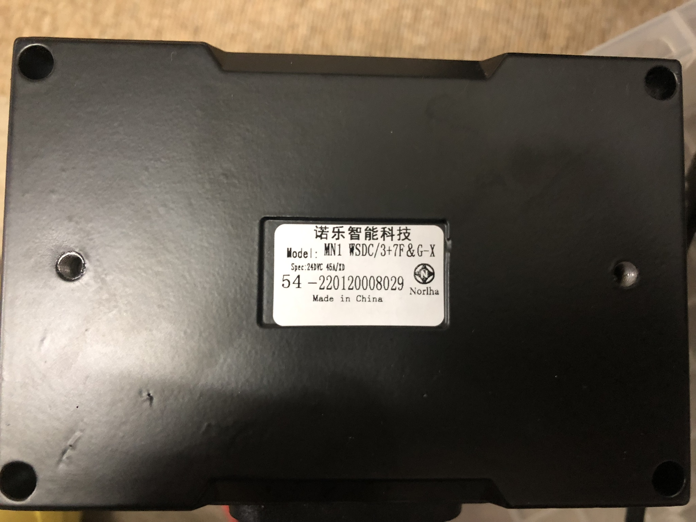

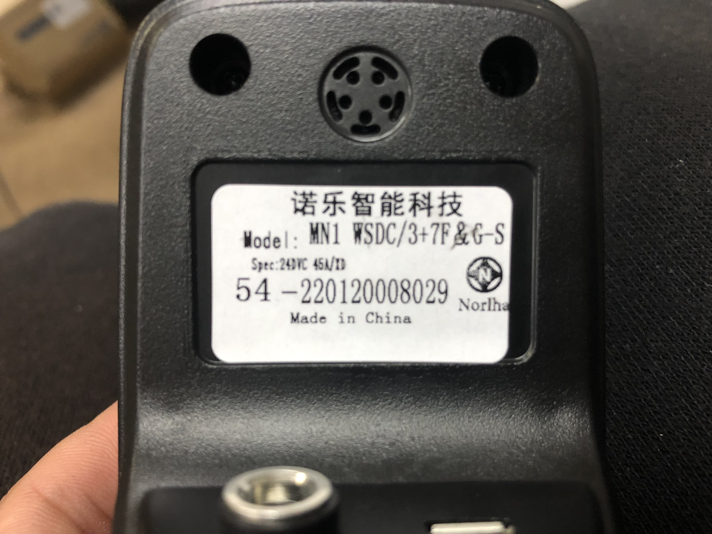

The supplier has changed some handshake package and data ranges, please check the detail on [this repo](https://github.com/rasheeddo/BrushlessDriveWheels/tree/new-batch-esc#hack-new-batch-esc). So we need to upgrade the new firmware too, to be able to use with this new batch ESC. The firmware of new ESC is as following

- 20220127_AT_JMOAB01_fw_v08.2_skidsteer_newESC_steer_REV.hex

- 20220127_AT_JMOAB04_fw_v08.2_skidsteer_newESC_steer_REV.hex

- 20220127_AT_JMOAB05_fw_v08.2_skidsteer_newESC_steer_REV.hex

Those three firmware has the same function, but only the hardware of the JMOAB version is different.


### Using wheel's hall effect sensor for odometer

The ATCart wheel itself doesn't give a feedback of anything, in order to get RPM of the wheel we need to install extra sensor attaching on the wheel. Please check the detail on [here](docs/wheels_hall_sensor.md).


## JMOAB with BNO055 9axis Orientation Sensor 

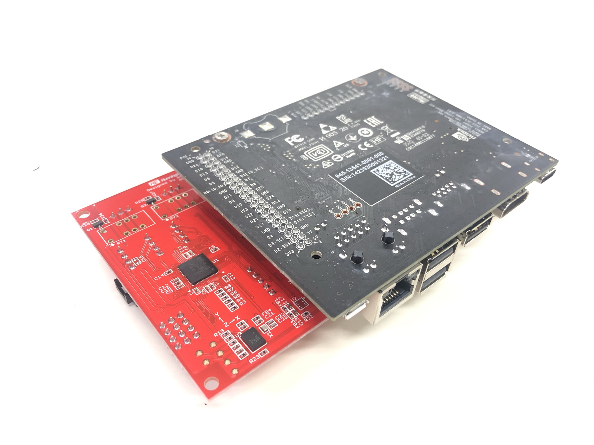

The default orientation of BNO055 on JMOAB is shown above. As default setup, we will have quaternion data in Fusion mode of IMU. In this mode we will get the data as relative from it firstly started.

### Run as IMU mode
To run the jmoab_ros_imu_node
- `rosrun jmoab-ros jmoab-ros-imu.py`

List out topics
- `rostopic list`, you would see there is a topic `jmoab_imu_raw` which is geometry sensor message as quaternion.

So if you place the Jetson upside down (heatsink is pointing down), so there is no need to do dot product of rotation matrix. You can use that quaternion directly, but if your Jetson is placed regularly (heatsink is point up), then you will need to do dot product of rotation matrix. Please check the detail on example directory `imu_listener.py` for how to use convert quaternion to Euluer angle (roll-pitch-yaw), and `imu_repeater.py` to repeat the raw value and republish with some rotation matrix.

We can visualize the imu topic by using rviz_imu_plugin (install from here http://wiki.ros.org/rviz_imu_plugin). Then we could run rviz with the config file [here](rviz/jmoab-imu-test.rviz) and [here](rviz/jmoab-imu-repeater.rviz).

### Run as compass mode
To run BNO055 as compass mode on JMOAB, we need to calibrate the sensor offset first, please check on the step on this [link.](example/compass_calibration_step.md)

Once the compass is calibrated, the sensor offsets are saved into `calibration_offset.txt` at `example/` directory. So when you run `jmoab-ros-compass.py` it would load that automatically.

Depends on how you place BNO055 board on the cart, you will face that there is some "heading_offset" when you move the cart even as straight line, but the heading is pointing to other direction. 

To solve that heading offset issue, if your GPS can get RTK-Fixed status, I have added the "Kalman filter" to estimate the heading offset during the operation. So you will need to move the cart in manual mode as straight line as much as possible, find some good flat ground to run the bot in manual mode for this process. The Kalman filter is trying to estimate the true offset by using the bearing angle of two consequential GPS points, that why you need to get RTK-Fixed status to be able to use this. After a while of running in straight line you will notice that the bot's heading kept adjusted to the correct heading by itself. This estimation process could be done during auto mode as well, but it will do the estimation only when there is no steering motion.

Please check on [this video](https://youtu.be/MqF1ztsyBPM) for more explanation of this algorithms.


## JMOAB with ADC

There is Analog-to-Digital converter port where you can use to measure with some sensor devices or battery. The pin header is J7, you could check more detail on the doc [here](docs/AT_JMOAB01_sch201201.pdf). If you are using with ATCart wheel system, then your ESC cable should be plugged on ESC ports (J9 or J10). Then you can monitor the ESC's voltage on A5 channel of ADC.

### Run
To run the jmoab_ros_adc_node
- `rosrun jmoab-ros jmoab-ros-adc.py`

List out topics
- `rostopic list`, you will see there is a topic `jmoab_adc` which is Float32Array message, it contains 6 of voltage values from 6 ADC ports. 

## JMOAB with F9P GPS

JMOAB has a GPS (UART) port which is connected to pin 8 and 10 of J41 header for `/dev/ttyTHS1` (UART_2).

In order to enable this port to use as regular user, please check on this [link](https://forums.developer.nvidia.com/t/read-write-permission-ttyths1/81623/6
) or following the step below.

- We will need to disable nvgetty

	```
	sudo systemctl stop nvgetty

	sudo systemctl disable nvgetty
	```

- Create a udev rule for ttyTHS* to get permission (without sudo)

	`sudo vim  /etc/udev/rules.d/55-tegraserial.rules`
	
- put this content on created udev rule file

	`KERNEL=="ttyTHS*", MODE="0666"`
	
- reload rules and reboot

	```
	sudo udevadm control --reload-rules

	sudo reboot
	```


If the GPS is plugging, then you could see a stream of NMEA or Ublox or both coming in this port.

I am using [this](https://www.sparkfun.com/products/15136) Ublox SparkFun F9P GPS, and fortunately there is an existing ROS package to parse this Ublox message and already pack it to `sensor_msgs/NavSatFix` for us to use, you can check it on KumarRobotics repo [here](https://github.com/KumarRobotics/ublox) and some setup [here](https://qiita.com/k-koh/items/8fd8ef6310e4f40fa536).

Once you clone that package, and did `catkin_make`. Next we need to change the content of config file on `ublox/ublox_gps/config/zed_f9p.yaml`. You can also make the new yaml file for your own. Then we have to put this content in to this file

```
device: /dev/ttyTHS1
frame_id: gps
uart1:
  baudrate: 115200
config_on_startup: false

publish:
  all: false
  nav:
    all: true
    relposned: true
    posllh: true
    posecef: true
```

Make sure you choose the correct baudrate according to your F9P Uart setup. If you don't know what is the baudrate of F9P's UART, you will need to check it with u-center software.

After everything is setup properly, and GPS is plugging on, we could start launch file to get GPS data with this command

`roslaunch ublox_gps ublox_device.launch node_name:=ublox param_file_name:=zed_f9p`

Make sure you specify the correct config file on `param_file_name`.

We could see the gps topic from `rostopic echo /ublox/fix`.

To visualize robot's GPS point and heading, please check on [this](example/gcs.md).

To get a precise position, it's better to use RTK base station with F9P GPS. So please following a step below to install RTKLIB.

- `sudo apt-get install gfortran`

- `git clone https://github.com/tomojitakasu/RTKLIB.git`

- `cd RTKLIB`

- `git checkout rtklib_2.4.3`

- `cd lib/iers/gcc`

- `make`

- `cd ../../../app/consapp/str2str/gcc`

- `make`

You will get str2str binary file at `RTKLIB/app/consapp/str2str/gcc/`, so before using it please check the base station from [here](http://rtk2go.com:2101/SNIP::STATUS) where closed to your place.

To run RTKLIB, you need to plub USB cable from F9P's USB to Jetson, it should be recognized as `/dev/ttyACM0` or something similar, then we could run the str2str binary as,

	./str2str -in ntrip://rtk2go.com:2101/InohanaKobo -out serial://ttyACM0:115200 -b 1

You must change your base station place according to where the closet to your place, in my case it's `InohanaKobo`.

## JMOAB with Two F9P GPS for better a heading!

One GPS and one BNO055 could be enough to run waypoints autonomous driving, but two GPS with one BNO055 is the best!

The second GPS could be placed at the front of the cart to use as the reference point for heading offset calculation. 

Previously, on one GPS and one compass setup, we have to run the bot in manual to get enough data to let the Kalman filter estimates the correct heading offset. But with 2nd GPS on front, we could have a better heading offset estimated once we started `jmoab-ros-compass-2gps.py` just in few seconds. So two GPS must have RTK-Fixed status, and the heading estimation will be done when the cart is moving as straight line or even at stationary.

Because there is only one UART on Jetson 40pins header, so we neeed to use USB port for the 2nd GPS. Please check on the wiring below.

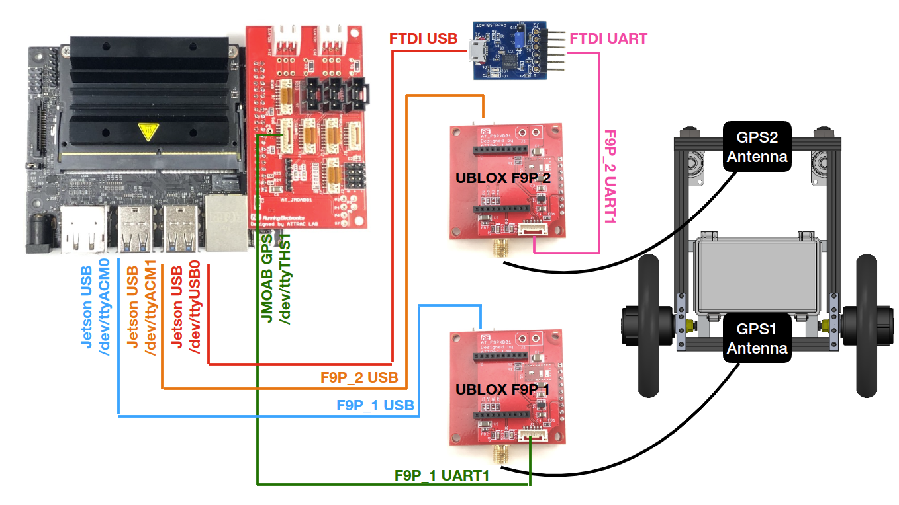

Then we need to make a copy of `zed_f9p.yaml` file of ublox_gps node, I make the new one name as `zed_f9p_2.yaml`. The content inside is mostly the same except we need to change the device as

```
device: /dev/ttyUSB0
frame_id: gps
uart1:
  baudrate: 115200
config_on_startup: false

publish:
  all: false
  nav:
    all: true
    relposned: true
    posllh: true
    posecef: true
```

To run two ublox GPS with the same launch file, please using two terminals with these two commands

	roslaunch ublox_gps ublox_device.launch node_name:=ublox param_file_name:=zed_f9p

	roslaunch ublox_gps ublox_device.launch node_name:=ublox2 param_file_name:=zed_f9p_2

Your 1st GPS will have the namespace as `/ublox/` and the 2nd GPS will have `/ublox2/`. 

The USB port of F9P GPS when plugging on Jetson would be recognized as `/dev/ttyACMx`. In case of two GPS, you will have `/dev/ttyACM0` for GPS1 and `/dev/ttyACM1` for GPS2. We will need to use RTKLIB to get RTK-Fixed status for both ports.

	./str2str -in ntrip://rtk2go.com:2101/InohanaKobo -out serial://ttyACM0:115200 -b 1

	./str2str -in ntrip://rtk2go.com:2101/InohanaKobo -out serial://ttyACM1:115200 -b 1


## JMOAB with DJI Ronin-SC control

DJI Ronin-SC handheld camera stabilizer is DSLR camera gimbal. It could be remotely operated by RC transmitter with SBUS signal. For more detail how, please check on this [video](https://www.youtube.com/watch?v=fCnYqv7fR_c&ab_channel=Mad%27sTech). 

In order to let the Jetson control the gimbal, we need to use a special JMOAB firmware (v07e_20210805_AT_JMOAB01&03_SBUSOUT.hex) which able to control ATCart wheels and also SBUS output on SBUS3 port. It could be found [here](./firmwares/)

We need to use `jmoab-ros-atcart-gimbal.py` to control the cart and gimbal.

There is still `/sbus_cmd` topic which going to receive sbus steering and throttle commands similar to normal `jmoab-ros-atcart.py`, and we have new topics as `/sbus_gimbal_cmd` which is the speed of pan and tilt of gimbal. For example, sending `[1680, 1024]` on this will make the gimbal panning in full speed, or `[1024, 1680]` will make the gimbal tilting in full speed. And there is `/gimbal_recenter` which is a boolean topic to recenter the gimbal back to home position. Send `True` to recenter the gimbal, and only needs one time (not continuous).


To publish custome topics for debugging, please check on this [rqt_ez_publisher package](http://wiki.ros.org/rqt_ez_publisher).

## JMOAB with Gazebo model and SITL

To run JMOAB ROS as SITL (without the actual hardware), at least we should have a gamepad for a robot controller in order to change mode, steering/throttle, and some switches. I am using Logicool F310, and the axes and buttons are assinged as below


### Dependencies

- Make sure you have `joy` package installed, `sudo apt-get install ros-$ROS_DISTRO-joy`.

- You will need to make sure, that the Gazebo's URDF file has `libgazebo_ros_imu_sensor` and `libhector_gazebo_ros_gps` plugins, to have the `ublox/fix` and `imu` topics publishing. So this URDF file depends on which model are using, and it's not in this package.

### Run

	rosrun joy joy_node

	rosrun jmoab-ros jmoab-ros-atcart-simulation.py

Start atcart simulation node, this will start an `atcart` node simulation which going to pubish `atcart_mode` as current mode, and to subscribe `atcart_mode_cmd` to get command mode, and `sbus_cmd` for sbus values of steering and throttle. So we can have the same manner of topics similar to the real cart. The robot mode in gazebo is using `cmd_vel` topic for drive the wheel, so this node will publish the `cmd_vel` according to the input of `sbus_cmd` topic or `joy` node from user manual control.

Once you change the mode by pressing X button on gamepad, the rover will be in manual mode, so you can drive it by throttle and steering analog stick as shown on image above. And once you pressed A button on gamepad, it will be in auto mode, and will listen on `sbus_cmd` topic for an autonomous drive program. B button is for hold mode, so it will stop moving. 

	rosrun jmoab-ros jmoab-ros-compass-simulation.py

Start a compass simulation node, this will be useful for outdoor GPS navigation, so you need to make sure there is `imu` topic publishing before. This node will publish `jmoab_compass` topic which is `[roll, pitch, heading]` std_msgs/Float32MultiArray the same as original `jmoab_compass` message. And also you can press Y button to do the `heading calibration` the same mannaer as `jmoab-compass.py` node as explained [at the end here](https://github.com/rasheeddo/jmoab-ros/blob/master/example/compass_calibration_step.md). Please make sure you have `ublox/fix` topic publishing.

	rosrun jmoab-ros jmoab-ros-adc-simulation.py

This is going to start a battery measurement simulation node, it's specified to use with 6S LiPo battery, so with fully charged it's 25.2V, and it could stay around 6 hours for a small cart. So first element of `/jmoab_adc` is a battery remaining voltage. We could try to simulate other Analog-To-Digital signal later on.


Or for a better convenience, we could run all of required nodes in a launch file as a command below

	roslaunch jmoab-ros jmoab-ros-simulation.launch

## JMOAB with ZLAC8015D Driver

The ZLAC8015D is dual brusless motor driver for 8 inch wheel. It could be used in both position and velocity control modes.

In order to use `jmoab-ros-zlac8015d.py` node, we have to install [this python API](https://github.com/rasheeddo/ZLAC8015D_python_API). 

Assuming that you cloned the above API to `/home/<Your-Username>/ZLAC8015D_python_API/` directory. You will need to link the `ZLAC8015D.py` class to `jmoab-ros/src` directory. Please run the command below, and replace `<Your-Username>` to correct username.

	ln -s /home/<Your-Username>/ZLAC8015D_python_API/ZLAC8015D.py /home/<Your-Username>/catkin_ws/src/jmoab-ros/src/ZLAC8015D.py

This will create the symlink of `ZLAC8015D.py` into `jmoab-ros/src`. So the `jmoab-ros-zlac8015d.py` can see the file.

### Topics

This node is publishing data as following

- `/odom`, we get the data from wheel's encoder as RPM in velocity control and wheel's travelled in position control, those data are used to calculate the robot odometry data. You will need to change `self.L` according to your wheel's base width.

- `/wheels_rpm`, the speed in RPM of each wheel as [left, right]

- `/sbus_rc_ch` and `/atcart_mode`, similar to ATCart.

This node is subscribing on,

- `/sbus_cmd` and `/atcart_mode_cmd`, similar to ATCart.

- `/zlac8015d/mode_cmd`, to change the ZLAC8015D mode, 1 for position control, 3 for velocity control

- `/zlac8015d/pos/deg_cmd`, to send command as angle degree in position control, e.g. [90,70] 90deg of left wheel, 70deg of right wheel.

- `/zlac8015d/pos/dist_cmd`, to send command as desired travelling distance, this would be correct if you are using 8 inch motors as default, e.g. [1.0, 1.0] for one meter travelling distance of each wheel.  

Please check on [this video](https://youtu.be/3gUNfJ94oac) for a demonstration.

### Odometry

Raw odometry of ZLAC8015D is good enough in some application, but for an indoor navigation which the robot would move around the room, the `/odom` topic can suffer from tire's slip and other factor which could make the odometry data got offset.

To get a better odometry, I would suggest to use [robot_pose_ekf](http://wiki.ros.org/robot_pose_ekf) to fuse IMU data with pure odometry. So please clone this package to your catkin workspace.

I changed [this](https://github.com/ros-planning/robot_pose_ekf/blob/fd6cef32b447e8b344a1111373e515aa2f8bfc50/robot_pose_ekf.launch#L5) `base_footprint` to `base_link`, and disable [this](https://github.com/ros-planning/robot_pose_ekf/blob/fd6cef32b447e8b344a1111373e515aa2f8bfc50/robot_pose_ekf.launch#L10) `vo_used` to false.

You can run the launch file below to start all necessary nodes,

	roslaunch jmoab-ros jmoab-ros-ekf-odom-zlac8015d.launch

This will start, 

- `jmoab-ros-zlac8015d.py`, to get pure wheel's odometry

- `jmoab-ros-imu.py`, to get jmoab_imu 

- `ekf_odom_generate.py`, a helper script to convert `/robot_pose_ekf/odom_combined` which doesn't have TF to `/ekf_odom` which has a proper TF.

- `robot_pose_ekf.launch`, ekf node to fuse data.

- and some static transform publisher.

Please check on [this video](https://youtu.be/XNgGo2GZ2M8) for a comparison of with/without `robot_pose_ekf`.

## JMOAB with BME680 sensor

...In development process


