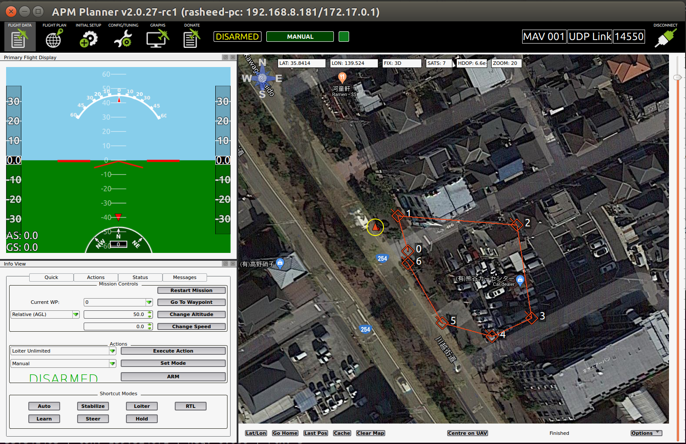
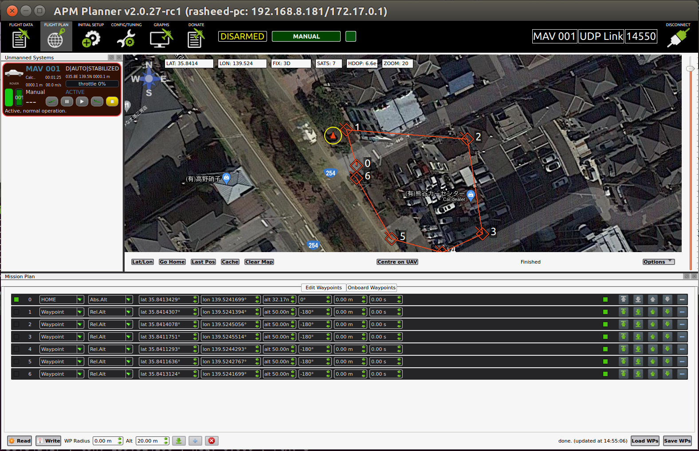

# Ground Control System (GCS)

To visualize the rover's GPS coordinates and heading, please make sure you have followed the setup process of BNO055 compass calibration and /dev/ttyTHS1 UART setup before.

To communicate between GCS and rover, we are going to use UDP port in LAN, so your robot and PC should be in the same network.

Please following the step below...

## On your computer (Ground Station)

- at this current time my visualizer code only supports APM Planner (and QGroundControl just some features), so you will need to install APM Planner v2.0.27-rc1 or close to this version. 

- open up APM Planner and go to `File` on upper left corner and enable `Advanced Mode`.

- at the same bar, go to `Communication` -> `Add Link` -> `UDP`, make sure you select port as 14550 (no need to fill ip), then click connect and close.

- make sure to turn off firewall, `sudo ufw disable`


## On Jetson (Rover)

- install `pymavlink` by `sudo pip install pymavlink`

- once `pymavlink` got intalled, we need to edit something on `mavutil.py`
	- go to file directory `cd /usr/local/lib/python2.7/dist-packages/pymavlink` 
	- edit the file, `sudo vim mavutil.py` or any editor you like.
	- go to line 1018 as [here](https://github.com/ArduPilot/pymavlink/blob/d349f5f211198682d08d48cb5fe16a8cd739afa4/mavutil.py#L1018), you can see line number on vim by setting `:set number` and enter.
	- add these two lines under else condition
		```
		self.port.setsockopt(socket.SOL_SOCKET, socket.SO_REUSEADDR, 1)
		self.port.bind(("0.0.0.0", 0))
		```
	- save and exit the file

	This will make the UDP able to communicate two ways on one port (14550)

- you will need dummy `mission.txt` and `autopilot.param` files, already located at `jmoab-ros/example`

- you could simply run `apm_planner_visualize.py --ip <your_pc_ip> --mission_dir <your_mission_file>`
	basically, if you don't have mission yet, it's okay to leave `--mission_dir` as blank, so it would use default mission file that I provided. Later on you once you have mission, you can put new directory here.

	`autopilot.param` file is nothing just only some parameters I copied from Cube purple to trick GCS that this autopilot device is Ardupilot, we could make our own paramters file in the future usage, but at this moment we don't have anything to do with it.


If everything running properly, APM Planner on your PC should connect to `apm_planner_visualize.py` automatically by MAVLink messages on UDP 14550 port.



You can make new mission and just simple hit `Write` button, then it will save this mission to the robot automatically (where you specified `--mission_dir` on Jetson). And also you can hit `Read` button to read the current mission on the bot too.



APM Planner doesn't support Geofencing feature, so we can only use it for waypoints mission.

QGroundControl supports Geofencing, but I still couldn't get it work...so we can only use waypoints mission for now.