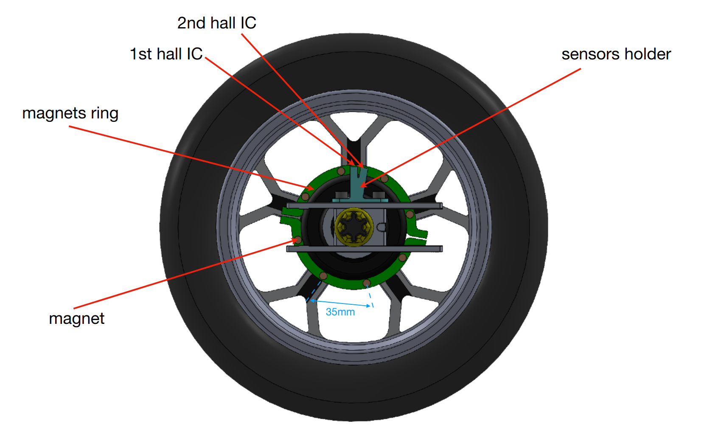
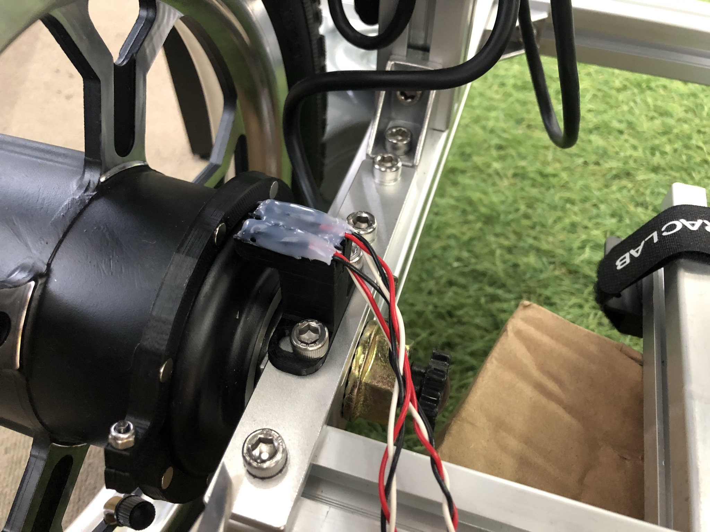
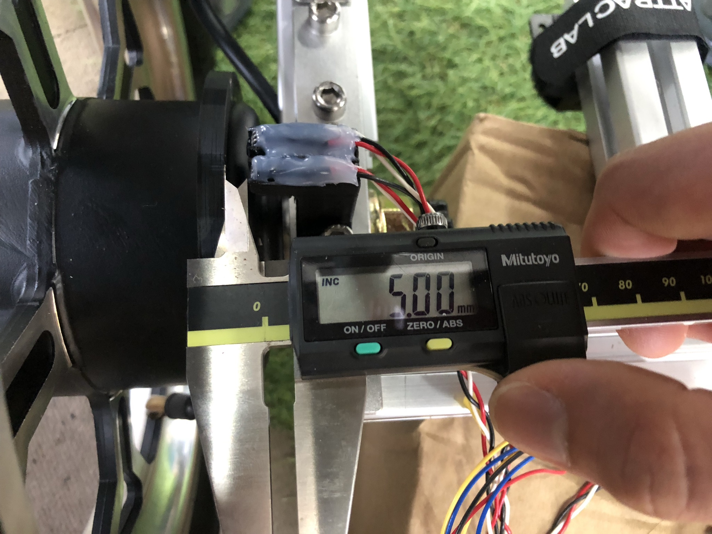
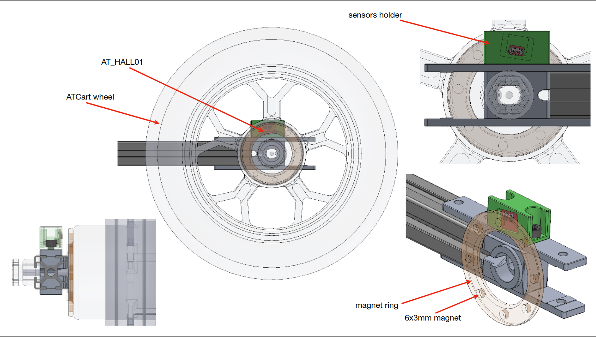
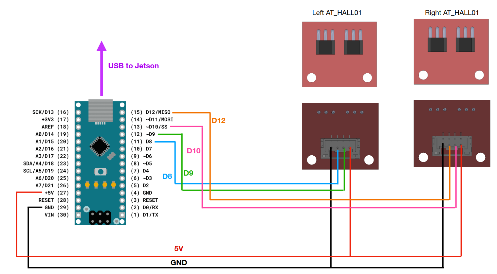

## Wheel's Odometer (Old design)

### Hardware

You will need the parts below

- 4pcs of Hall effect IC SK8552G-G03-K 
- 16pcs of 6x3 magnets
- 2pcs of sensors holder
- 2pcs of magnets ring
- 1pc of Arduino nano
- 1pc of USB-B mini type

### Software

The source code to read sensor and calculate RPM is written in Arduino C++, you can check the file on [here](../arduino/hall_odom_2wheels_PCINT/hall_odom_2wheels_PCINT.ino).

And the source code to use this RPMs on ros node is `jmoab-ros-wheels-rpm.py`

### Install

- attaching a magnets ring on the wheel hub motor, please tight screws of both side evenly.
- attaching a sensors holder on the cart's frame. On the left wheel side, the sensor's cable should be makred as 8 and 9, and on the right side, the sensor cable should be marked as 10 and 12. Those numbers are corresonding to the Arduino pins.
- adjusting the sensor to close to the magnets ring around 5mm

- plug all the sensor cables to Arduino nano, and plug USB port to computer.
- make sure the computer could detect USB device by using `ls /dev/tty*`, there would be `/dev/ttyUSB0` existing on the list.
- add permission to access USB device, `sudo usermod -a -G dialout nvidia`, then reboot. This is only one time setup.
- run roscore on one of terminal, then run this node `rosrun jmoab-ros jmoab-ros-wheels-rpm.py /dev/ttyUSB0`, make sure your USB device is correct on the argument.
- if there is no error, you should see `/wheels_rpm` topic. The first array element is rpm on the left wheel, and second element is rpm on the right wheel.

***NOTE***
The minimum RPM that this sensor can read is +/-5 rpm, lower than this value it will give 0 rpm.

## Wheel's Odometer (New design)

The hardware components of new design are same as old one, but this one is using PCB board to attach both hall effect IC of one side.

The magnet ring of this new design uses simple 1mm double-sided tape to attach on wheel's surface. The sensor holder is used to hold PCB of AT_HALL01. You can check on the wiring below. The AT_HALL01 uses 4pin JST connector (BM04B-GHS-TBT).

Arduino's firmware and `jmoab-ros-wheels-rpm` are same.

Please check on [this video](https://youtu.be/tCoUMoUfn2s), of how to operate it.

## Nodes

Once you started `jmoab-ros-wheels-rpm.py`, it's publishing

- `wheels_rpm` as array of [left_rpm, right_rpm]

- `wheels_speed` as array of [VL, VR], linear velocity of the wheels

- `odom` as Odometry topic, this is quite poor because our sensor is only 8 ticks per revolution.

To improve the odom topic, we need [robot_pose_ekf package](http://wiki.ros.org/robot_pose_ekf) to fuse the sensor of wheel's odometry with IMU sensors.

I changed [this](https://github.com/ros-planning/robot_pose_ekf/blob/fd6cef32b447e8b344a1111373e515aa2f8bfc50/robot_pose_ekf.launch#L5) `base_footprint` to `base_link`, and disable [this](https://github.com/ros-planning/robot_pose_ekf/blob/fd6cef32b447e8b344a1111373e515aa2f8bfc50/robot_pose_ekf.launch#L10) `vo_used` to false.

You will need to run

	roslaunch jmoab-ros jmoab-ros-ekf-odom-test.launch

to start the nodes, and also

	roslaunch robot_pose_ekf robot_pose_ekf.launch

You will get `ekf_odom` topic for a fused odom. Please check on this [demo video](https://www.youtube.com/watch?v=SlqJzMmxYxU&ab_channel=stepbystep-robotics).

The green arrow is `ekf_odom`, red arrow is original `odom`.