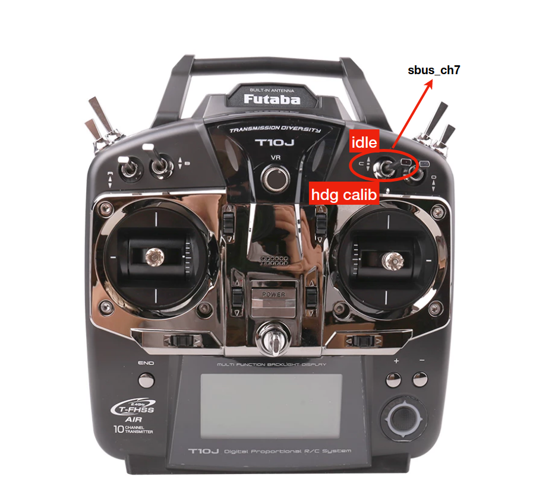

# BNO055 Compass and Heading offset calibration step

- make sure the Jetson with JMOAB is not lock with the vehicle (in case of medium and huge cart)
- open the file `example/bno055_compass_calibrate.py`, and make sure the sensor's orientation is placed correctly with `config_axis_sign()` and `config_remap()` functions inside.
- then run `example/bno055_compass_calibrate.py` it will print all of sensors status, we need to make all sensors status equal to 3
	- gyro calibration: keep it steady in place will make it success
	- acc calibration: place it in some angles like 45,90,180,-45,-90 wil make it success
	- mag calibration: moving the whole board in the air, draw "8" in the air would make it success
	- once all succeed, it will print the sensor offset, make sure it's not all 0
- we can make sure our compass is working by running `example/bno055_compass_test.py`, comfirm the heading angle with other compass source (mobile phone)
- run these
	- `roslaunch ublox_gps ublox_device.launch node_name:=ublox param_file_name:=zed_f9p` make sure we have this package with proper config file
	- 
		`cd /home/nvidia/RTKLIB/app/consapp/str2str/gcc`
		`./str2str -in ntrip://rtk2go.com:2101/KAIT-RTCM3 -out serial://ttyACM0:115200 -b 1`
		 
	this is to run RTK and make GPS more accurate, make sure to have RTKLIB install and GPS USB port connect as ttyACM0
	you can check which RTK base station is closed to you from [here](http://rtk2go.com:2101/SNIP::STATUS)

	- `rosrun jmoab-ros jmoab-ros-atcart.py` to get access of `sbus_rc_ch`, `sbus_cmd`, `atcart_mode`, `atcart_mode_cmd` topic

- The heading offset calculation requires the bot to move as straight line as much as it can, so we need to experiment the value of sbus_steering where it can make the bot run as straight line. You can experiment that by using a script `example/sbus_cmd_sender.py` and keep changing `sbus_steering` until you found the sweet spot.

- Once you get a good sbus_steering where it goes straight, then replaced on line 147 of `jmoab-ros-compass.py`

- run `rosrun jmoab-ros jmoab-ros-compass.py` to start using compass with `hdg_offset` as 0.0 at first.

- run `example/apm_planner_visualize.py --ip <your_pc_ip>` to visualize the GPS point on map,you will see our heading is not correct now.

- Grab your radio transmitter, I am using Futaba transmitter, and set channel 7 as switch C as shown in the image, please set it on your transmitter too.

- To calibrate heading offset we need to switch down ch7 to `hdg_calib` or `sbus_ch7 = 1904` then the bot will move as straight line and we switch up back to `idle`. The bot will use gps starting point and last point then calculate the bearing of it. So we can have `hdg_offset` at the end. This can be done even during autonomous drive, but I recommend to pause the autonomous drive first.